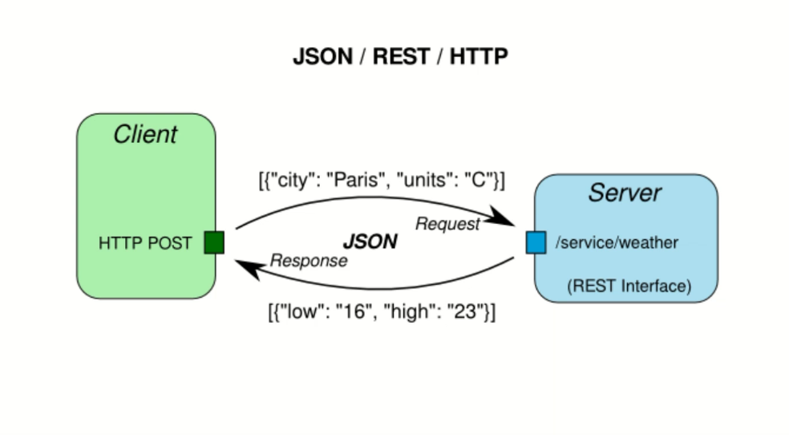

## Json Nedir?
#### Açılımı javaScriptObjectNotation'dur.
#### Json, bir veri değişim formatıdır.
#### Temel amacı XML'e göre daha küçük boyutlarda veri taşımaktır.
#### XML'den daha hızlıdır.
#### Yazım şeklindeki farklardan dolayı XML'den daha az yer kaplar.
## JSON KULLANIM ALANLARI 
#### JavaScript için tasarlanmıştır.
#### ancak günümüzde birçok programlama dili ve platform tarafından kullanılıyor.
#### ÖRN: PHP-.NET-JAVA-....
#### Json ile mobil uygulamalar ve masaüstü yazılımları gibi farklı platformlar arasında veri taşınabilir.
####

#### lsdldfslö
dfsf
