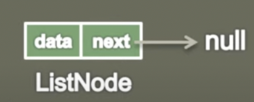

## Data Structures and Algorithms in Java
- Hello everyone let's learn Data Structures and Algorithms 
- We use Java because that's nice language for learning.
- Please read and learn other source this subject's: "Space Complexity,Asymtotic Analysis, Asymtotic Notations,Big O Notations,Calcuate Time Complexity of Algorithm"
- I recommanding Dinesh Varyani Youtube channel. He's a good teacher.
- Visit https://www.youtube.com/watch?v=6iCHf7OZn6c&list=PL6Zs6LgrJj3tDXv8a_elC6eT_4R5gfX4d&index=1
- Okay Let's go!
- We first talk about the Singly Linked List 
#
Singly linked List is a data structure used for storing collection of nodes and has following properties
- It contains sequence of nodes
- A node has data and reference to next node in a list.
- First node is the head node.
- Last node has data and points to null.

- ( I'll add image in the other time)
#
Implementation of a ListNode in Singly Linked List
- Now we will see the implementation of the ListNode in Singly Linked List.
-
```
// Generic Type 
// The list node is holding the data which is Generic Type
public class ListNode<T>{
    private T data;
    private ListNode<T> next;
}

// Integer Type 
// This snippetis you can see that it is holding the data of integer type data
public class ListNode{
    private int data;
    private ListNode next;
}
```
So if see the graphical representation of it looks something like this 


> the ListNode is having a data  

